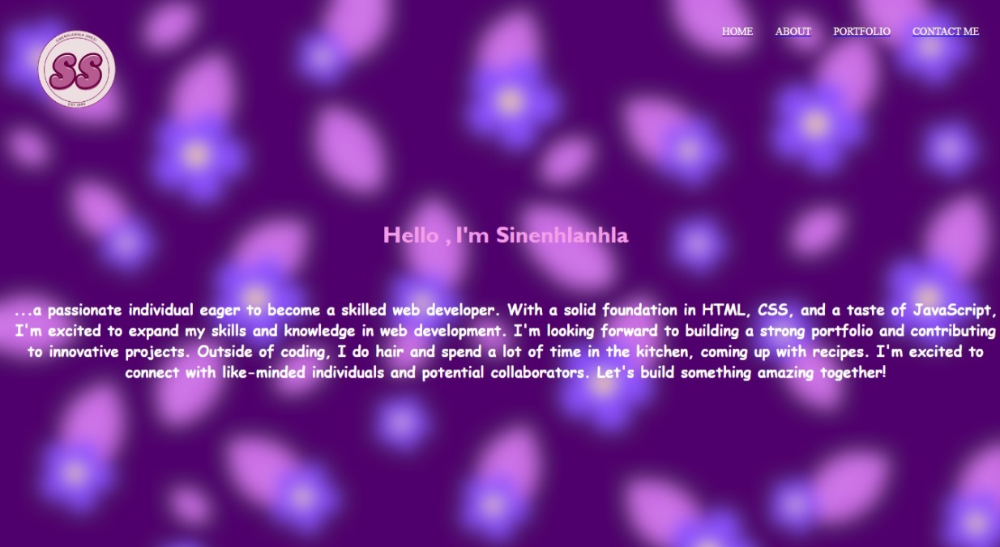
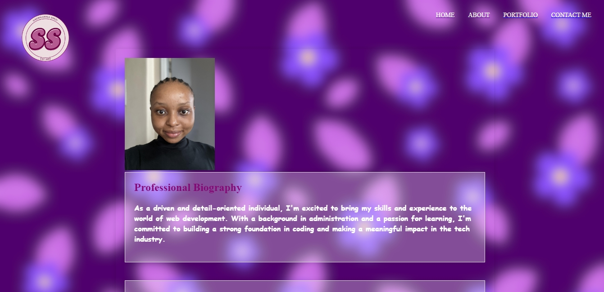
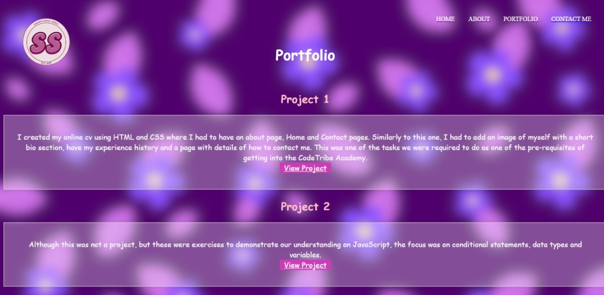
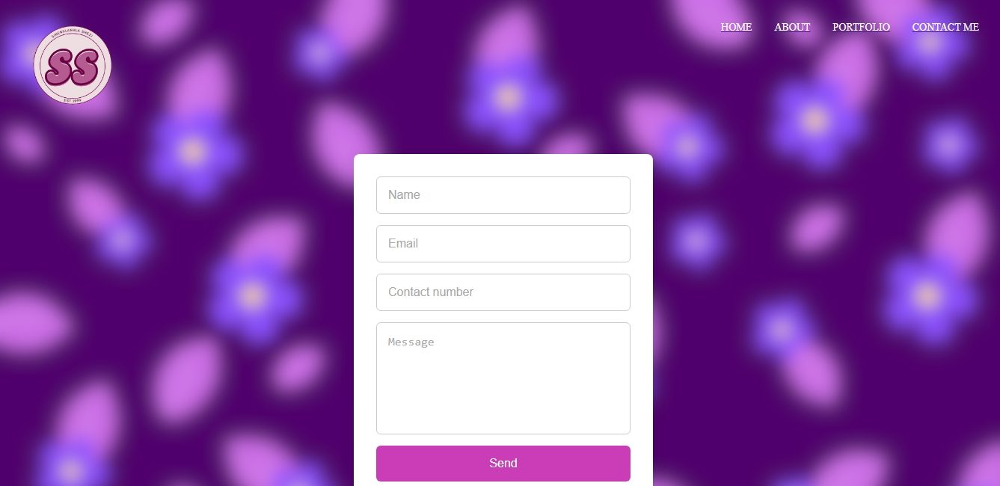

# PortfolioWebsite

DEPLOYMENT (Vercel) URL : https://sinenhlanhlahlengiwe.vercel.app/home

This project was generated with [Angular CLI](https://github.com/angular/angular-cli) version 18.2.1.

## Overview

Welcome to my portfolio website, showcasing my skills and experiences as a student. This website is designed to provide an overview of my work, interests, and contact information.

## Features

- Home Page: Introduction to my portfolio and latest updates
- About Page: Detailed information about my background, skills, and experiences
-Portfolio Page: Detailing a few projects I have done.
- Contact Me Page: Get in touch with me through email or social media

## Technologies Used

Built with Angular framework

## Screenshots

## Home Page

## About Page

## Portfolio Page

## Contact Page

## Getting started

To run this application locally:

1. Clone the repository using `git clone (link unavailable)
2. Install dependencies using npm install
3. Run the application using ng serve
4. Open your browser at http://localhost:4200

## Further help

To get more help on the Angular CLI use `ng help` or go check out the [Angular CLI Overview and Command Reference](https://angular.dev/tools/cli) page.
